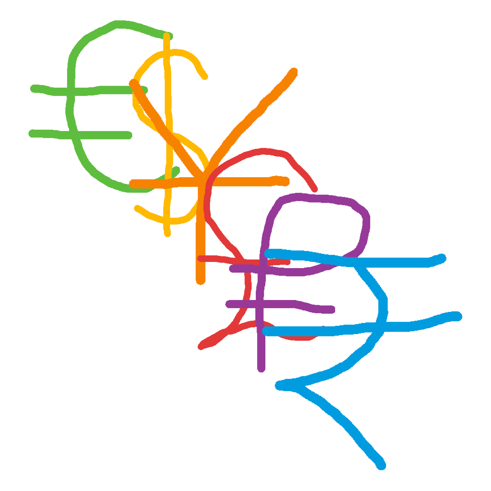

# Currency Exchange

Objc version of [Currency Exchange](https://github.com/francistopher/CurrencyExchangeSwift)

Retrofied version

## To do 

- idk how yet but wait for entire HTML data to load
- scrape forex rates from [this](https://finance.yahoo.com/currencies/) with regex

